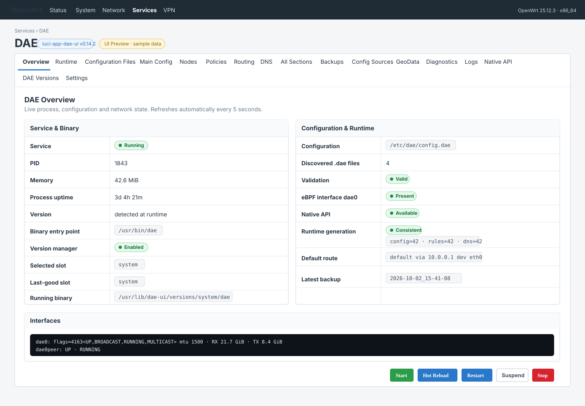

# luci-app-dae-ui

**English** | [简体中文](README.zh-CN.md)

A modern, safety-oriented LuCI control plane for **dae** on OpenWrt.

`luci-app-dae-ui` combines day-to-day dae configuration management, runtime observability, Native API integration, diagnostics, GeoData maintenance, and reboot-safe multi-version binary management in one LuCI application.

> **Current version:** v0.14.3  
> **Current status:** feature-complete for the v0.14.x scope; real-router validation is the remaining release gate.

## Why this project exists

Existing dae frontends tend to focus on either configuration editing or runtime visibility. This project aims to provide both, while keeping OpenWrt operational safety as the primary constraint.

The UI is designed around three rules:

1. **Do not fabricate runtime state.**  
   Local process and kernel data is shown directly. Native-only data is shown only when the dae Native API explicitly advertises that capability.

2. **Do not silently rewrite user-owned configuration.**  
   Managed writes are staged, diffable, validated, backed up, and rolled back on failure.

3. **Do not make dae binary switching fragile.**  
   Version selection survives reboot and falls back through `selected → last-good → system` without rewriting `.dae` files.

## Highlights

- Native LuCI JavaScript UI
- Simplified Chinese and English, following the LuCI system language automatically
- Live Overview and Runtime dashboards
- Context-aware CodeMirror DAE editor
- Include-aware multi-file configuration management
- Safe validate / apply / hot-reload / rollback workflow
- Nodes, subscriptions, policy groups, routing and DNS views
- Native API capability discovery
- Connections, flows, runtime policies, DNS telemetry and rule dictionaries when supported by the backend
- Generation-safe retained-flow and rule correlation
- Explicit node/group probes with backend-advertised limits
- Verified GeoData pin refresh and update
- Persistent DAE Version Manager with reboot fallback
- Diagnostics, logs, backups and restore workflows
- Security boundaries around Native API tokens and file access

## Screenshots

The image below is a **UI design preview with sample state data**, based on the current v0.14.3 interface. It is not a real-router capture.



Real OpenWrt screenshots will be added after the v0.14.3 router validation pass. Planned captures:

- Simplified Chinese **Overview**
- Simplified Chinese **Runtime** with populated traffic charts
- Simplified Chinese **DAE Version Manager**
- Simplified Chinese **Configuration Files** editor

See [docs/screenshots/README.md](docs/screenshots/README.md) for the preview note plus the real-device capture and redaction checklist.

<!--


-->

## Interface

The application appears under:

```text
Services → DAE
```

Main pages:

| Page | Purpose |
| --- | --- |
| Overview | Service state, version, config validation, dae0, Native API and generation status |
| Runtime | CPU, memory, sockets, dae0 traffic trends and runtime capability matrix |
| Configuration Files | Safe multi-file DAE editing with validation diagnostics |
| Main Config | Main dae configuration |
| Nodes | Node and subscription management |
| Policies | Policy groups and staged visual group builder |
| Routing | Routing rules and Native rule dictionary |
| DNS | DNS upstreams, managed DNS config and Native DNS rules |
| All Sections | Structural view of recognized DAE config sections |
| Backups | Diff, restore + validate, restore + reload |
| Config Sources | Discovered source files and ownership |
| GeoData | Pinned GeoIP / GeoSite metadata and verified updater |
| Diagnostics | Process, config, dae0 and route checks |
| Logs | Live log view with pause / resume / clear |
| Native API | Discovery, capability matrix and optional token configuration |
| DAE Versions | Multi-version binary manager |
| Settings | Integration paths and package settings |

Native-only pages remain hidden until the corresponding capability is reported.

## Runtime observability

The Runtime page polls local state without requiring Native API support.

Local metrics include:

- process CPU
- RSS memory
- process uptime
- process-owned socket FD count
- `dae0` / `dae0peer` counters
- current RX / TX rate
- 60-second traffic trend
- 5-minute traffic trend
- current / average / peak rate
- recent WARN / ERROR marker summary

Traffic charts are calculated locally from kernel interface counters. They are intentionally not presented as Native API proxy accounting.

## Configuration editing

The built-in CodeMirror editor provides:

- line numbers
- DAE syntax highlighting
- bracket matching
- auto-close
- folding
- `Ctrl+Space` / `Cmd+Space` completion
- context-aware suggestions for `global`, `group`, `dns` and `routing`
- routing matcher and outbound/group completion
- validation diagnostics in the editor gutter
- first-error navigation

The UI discovers `.dae` files below the active configuration directory and validates writes against the complete main configuration, so include relationships are checked as a unit.

### Safe apply model

Managed writes use this flow:

```text
edit
 ↓
timestamped backup
 ↓
dae validate
 ↓
write
 ↓
hot reload
 ↓
runtime result
```

If validation or reload fails:

```text
failure
 ↓
restore previous file
 ↓
report diagnostics
```

Managed config sections are stored under:

```text
config.d/dae-ui-*.dae
```

The UI refuses managed writes unless the main dae configuration already includes:

```text
config.d/*.dae
```

It does not silently add that include.

## Nodes, subscriptions and policies

The source-oriented views preserve advanced user configuration while providing structured summaries and staged helpers.

Supported features include:

- node and subscription cards
- protocol-aware node staging
- tagged subscription staging
- HTTP / HTTPS / SOCKS4 / SOCKS5 URI builder
- exact runtime tag correlation when Native API data is available
- TCP / UDP latency observations
- subscription runtime member expansion
- policy group cards
- exact group-name runtime correlation
- current TCP / UDP runtime selections
- visual staged group builder

Supported common policy syntax includes:

```text
fixed(0)
min
min_moving_avg
min_avg10
random
```

Credentials, opaque payloads and subscription secrets are redacted in summaries without modifying the source configuration.

## Routing and DNS

Routing and DNS pages combine source configuration with optional Native API dictionaries.

### Native traffic rules

When `rules` is advertised, the UI exposes a read-only rule dictionary tied to the running `generation_id`.

Rule-source navigation follows:

```text
rule.source.source_id
        ↓
Native config source
        ↓
exact local .dae path match
```

Display-only backend file labels are never treated as trusted local file paths.

### Native DNS rules

When `dns_rules` is advertised, request and response rules are shown separately.

Request actions may include:

```text
upstream / asis / reject
```

Response actions may include:

```text
accept / reject / requery
```

Rule links are generation-qualified. Historical evidence is never joined to a different current rule generation.

## Native API model

The backend probes:

```text
/api
/api/v1/capabilities
```

Native-only features are capability-driven.

Examples include:

- detailed connections
- node inventory
- node/group probes
- runtime policy selection
- flows
- routing trace
- DNS query
- DNS cache
- DNS log
- routing rules
- DNS rules

The LuCI frontend cannot submit arbitrary Native API URLs.

### Token security

Optional Bearer authentication is stored outside UCI:

```text
/etc/dae-ui/native-api.token
```

Security properties:

- token directory: `0700`
- token file: `0600`
- token is never returned to browser JavaScript
- `native_api.secret` is never copied automatically
- token is used only by server-side requests
- token is removed when the package is uninstalled

## Connections and retained flows

Connections and flows are read-only.

A live connection receives a Timeline action only when the backend provides a real `flow_id`. The UI never invents a flow identity for an unrecorded connection.

Retained flow detail is read only from:

```text
GET /api/v1/flows/{flow_id}
```

The timeline can show:

- input
- route evaluation
- datapath action
- dial mode
- DNS evidence
- reroute decision
- outbound selection
- connection milestones

Each retained step keeps:

- `observed_at`
- `elapsed_us`
- `generation_id`
- evidence type
- raw JSON disclosure

Flow-to-rule links require an exact generation match.

## Node and group probes

Probe controls appear only when the backend advertises the required targets, kinds, transports, IP families and operation limits.

No probe runs automatically.

The user must explicitly start each probe.

Group probes:

- use direct members only
- respect group `probe_transports`
- split work according to `max_members_per_job` and `max_results_per_job`
- run batches sequentially
- preserve completed partial results if a later batch fails

## Native diagnostics

The UI exposes only bounded diagnostic operations from the shared contract.

### DNS Query

Uses the typed diagnostic resource:

```text
GET /api/v1/dns/query
```

### Routing Trace

Uses:

```text
POST /api/v1/routing/trace
```

The result is explicitly presented as a hypothetical routing simulation, not as a recorded flow.

The UI does not expose arbitrary Native API POSTs, connection termination, runtime policy mutation, DNS cache deletion, or arbitrary config writes.

## DAE Version Manager

The Version Manager keeps multiple dae binaries in immutable slots:

```text
/usr/lib/dae-ui/versions/<slot>/dae
```

### Official releases

Official releases are queried on demand from `daeuniverse/dae`.

Before a release is installed, the backend:

1. filters assets by router architecture;
2. obtains a trusted SHA256 from current GitHub metadata or the official `.dgst` asset;
3. verifies the archive;
4. extracts the dae binary;
5. executes a smoke test;
6. validates the actual OpenWrt dae service configuration.

Downloading a release never activates it automatically.

### Local binary and archive import

A trusted local dae executable can be imported directly from the browser. v0.14.2 also accepts official or custom archives, so users do not need to extract dae on another machine first.

Supported inputs:

- raw dae executable
- `.zip`
- `.tar.gz`
- `.tgz`

The Version Manager provides a drag-and-drop upload area as well as click-to-select behavior.

For archive uploads, the backend:

- keeps the upload destination fixed at `/tmp/dae-ui-dae-upload.bin`;
- accepts only metadata such as the original filename through rpcd, never an arbitrary server-side path;
- rejects unsafe archive member paths and archives with excessive entries;
- requires exactly one `dae` or `dae-*` payload;
- streams only that payload into a private temporary file instead of extracting the archive tree;
- limits the extracted payload to 128 MiB;
- calculates both archive SHA256 and binary SHA256;
- smoke-tests the extracted binary;
- validates the active service configuration;
- stores the binary in an immutable SHA256-addressed slot.

Manual uploads remain trust-based: the plugin does not claim that an offline archive is an official release merely because its filename looks official. Importing never activates the binary automatically.

### Reboot safety

Before first takeover, the package-managed `/usr/bin/dae` is captured into a protected `system` slot.

Then `/usr/bin/dae` becomes a persistent managed runner. The upstream `/etc/init.d/dae` is left unchanged.

The boot guard:

```text
/etc/init.d/dae-ui-version
START=98
```

runs before the normal dae service and validates:

```text
selected
   ↓
last-good
   ↓
system
```

Fallback changes binary selection only. It does not rewrite user configuration.

If a later dae package upgrade overwrites `/usr/bin/dae`, the boot guard captures the new package binary, preserves the previous system binary as an immutable `system-prev-*` slot, and reinstalls the managed runner.

## GeoData

The GeoData updater reads pinned metadata from the fixed dae upstream source:

```text
daeuniverse/dae/main/scripts/fetch-geo-data.sh
```

Only numeric release versions and 64-hex SHA256 values are accepted.

Persisted pins are stored under:

```text
/etc/dae-ui/geodata-pins
```

Downloads remain restricted to the fixed v2fly GeoIP and domain-list-community release repositories.

Update flow:

```text
fixed upstream pin source
        ↓
persist version / SHA256
        ↓
download to /tmp
        ↓
SHA256 verify
        ↓
backup existing file
        ↓
atomic replace
```

No unverified `latest/download` URL is used.

## Backups, logs and diagnostics

The project includes:

- timestamped config backups
- per-file diff
- restore + validate
- restore + reload
- direct editor navigation to safe `*.dae:line:column` validation locations
- live logs
- pause / resume
- log clear
- process diagnostics
- configuration validation
- dae0 presence checks
- default-route checks

## Language support

v0.14.1 includes built-in Simplified Chinese support.

The UI follows the LuCI system language automatically:

```text
English      → English UI
简体中文      → Simplified Chinese UI
```

English remains the source and fallback language.

The translation catalog is maintained under:

```text
po/zh_Hans/dae-ui.po
po/templates/dae-ui.pot
```

CI verifies that current frontend and menu strings have Simplified Chinese coverage.

## Build and install

### GitHub Release package

For OpenWrt 25.12.x, version tags automatically build an APK with the official OpenWrt 25.12.5 SDK and attach it to the GitHub Release together with `SHA256SUMS` and `INSTALL.txt`.

The package is architecture-independent (`PKGARCH=all`) but requires `dae` and the declared LuCI/rpcd dependencies to already be installed or available from configured repositories.

Because GitHub Release assets are not signed by the OpenWrt distribution signing key, install a downloaded local package explicitly:

```sh
apk add --allow-untrusted /tmp/luci-app-dae-ui-<version>-r1.apk
```

The Release workflow verifies that the Git tag matches `PKG_VERSION` before publishing.

### Build from source

Copy or clone this repository into an OpenWrt build tree as a package, for example:

```sh
git clone https://github.com/Accelerator6666/luci-app-dae-ui.git \
    package/luci-app-dae-ui
```

Then select and build the package through the normal OpenWrt build system.

The package depends on dae and the required LuCI/rpcd runtime components.

Default paths:

```text
/usr/bin/dae
/etc/init.d/dae
/etc/dae/config.dae
/var/log/dae/dae.log
```

Integration paths can be adjusted under:

```text
Services → DAE → Settings
```

## Project status

The v0.14.x architecture and feature set are implemented.

The remaining release work is router-side validation, especially:

- CodeMirror completion and inline diagnostics
- Runtime 60-second / 5-minute traffic charts
- Native generation consistency
- node/subscription runtime correlation
- visual policy staging
- retained flow detail
- custom dae binary import
- GeoData pin refresh
- selected version persistence after reboot
- Simplified Chinese rendering on a Chinese LuCI installation

See [RELEASE_NOTES_v0.14.3.md](RELEASE_NOTES_v0.14.3.md), [RELEASE_NOTES_v0.14.2.md](RELEASE_NOTES_v0.14.2.md), [RELEASE_NOTES_v0.14.0.md](RELEASE_NOTES_v0.14.0.md) and [CHANGELOG.md](CHANGELOG.md) for detailed release history.

## Inspiration

The project takes architectural and UX inspiration from:

- [QiuSimons/luci-app-honk](https://github.com/QiuSimons/luci-app-honk)
- [Zakkaus/doona](https://github.com/Zakkaus/doona)
- Doona / dae Native API documentation and contract ideas

The goal is not to clone any one of them, but to provide a native OpenWrt control plane with explicit safety boundaries.

## License

GPL-3.0-only.
